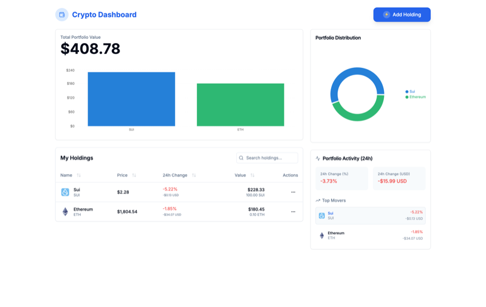
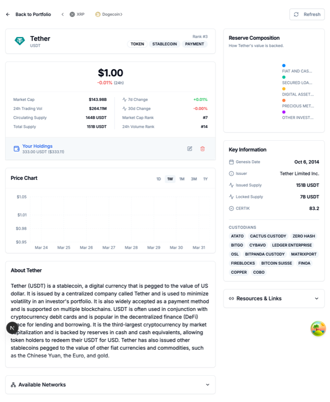
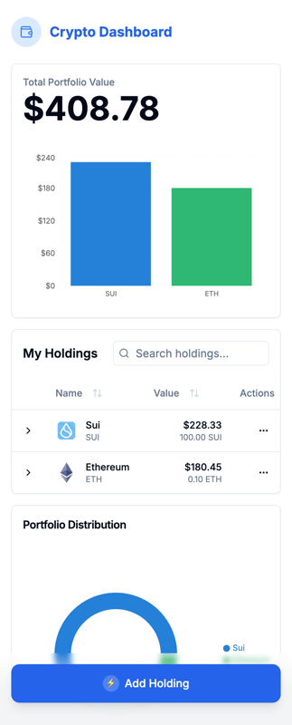
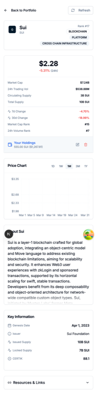

# Crypto Portfolio Tracker

A modern, responsive cryptocurrency portfolio tracking application built with React, Next.js, TypeScript, Tailwind CSS, Zustand, and React Query.

This README provides a high-level overview. For more detailed information on specific aspects, please refer to the files in the [`docs/`](./docs/) directory.

## Features

- 📱 Responsive design for desktop and mobile devices
- 💰 Track multiple cryptocurrencies in your portfolio
- 📊 View cryptocurrency price data and historical charts
- 📈 Visualize portfolio value and asset distribution
- 🔄 Add, edit, and remove holdings

## Screenshots

**Desktop:**




**Mobile:**




## Getting Started

### Prerequisites

- Node.js 18.x or higher
- npm or yarn

### Installation

1. Clone the repository

```bash
git clone https://github.com/yourusername/crypto-portfolio-tracker.git
cd crypto-portfolio-tracker
```

2. Install dependencies

```bash
npm install
# or
yarn install
```

3. Create a `.env.local` file by copying `.env.example`:

```bash
cp .env.example .env.local
```

4. **Optional:** Add your CryptoCompare API key to `.env.local` (see API Integration below).

5. Start the development server

```bash
npm run dev
# or
yarn dev
```

6. Open [http://localhost:3000](http://localhost:3000) in your browser to see the application.

## API Integration

The application uses the [CryptoCompare API](https://min-api.cryptocompare.com/) to fetch real-time cryptocurrency data. Mock data is used as a fallback if no API key is provided.

**Setup:**

1. Obtain an API key from [CryptoCompare](https://www.cryptocompare.com/api-keys/).
2. Add your API key to the `.env.local` file:

```env
# .env.local
NEXT_PUBLIC_CRYPTOCOMPARE_API_KEY=your_api_key_here

```

For more details on data fetching strategies, caching, error handling, and API usage, see [`docs/DATA_FETCHING.md`](./docs/DATA_FETCHING.md).

## Project Structure

The project follows standard Next.js App Router conventions. See [`docs/ARCHITECTURE.md`](./docs/ARCHITECTURE.md) for a more detailed architectural overview.

- **`app/`**: Next.js App Router structure.
    - **`dashboard/`**: Main portfolio dashboard page.
        - [`_components/`](./app/dashboard/_components/README.md): Dashboard-specific UI components.
    - **`details/[id]/`**: Dynamic asset details page.
        - [`_components/`](./app/details/[id]/_components/README.md): Details page-specific UI components.
    - `(page|layout|providers|globals).tsx/css`: Root layout, providers, global styles, entry page.
- **`components/`**: Reusable UI components. See [`docs/COMPONENTS.md`](./docs/COMPONENTS.md) for conventions.
    - **`ui/`**: Base UI components (Shadcn UI).
    - Application-specific reusable components (`HoldingForm`, `PriceChart`, etc.).
- **[`lib/`](./lib/README.md)**: Core logic, utilities, state, types, and data fetching.
    - **`api-clients.ts`**: Low-level API interaction functions.
    - **`data/`**: Higher-level server-side data fetching.
    - **[`hooks/`](./lib/hooks/README.md)**: Custom React hooks.
    - **`store.ts`**: Zustand store definition (See [`docs/STATE_MANAGEMENT.md`](./docs/STATE_MANAGEMENT.md)).
    - **`types/`**: Shared TypeScript definitions.
    - **`utils.ts`**: General utility functions.
    - Other utilities (colors, mock data).
- **`public/`**: Static assets.
- **`docs/`**: Project documentation files.
- **Configuration Files**: `.env.local`, `next.config.mjs`, etc.

## Deployment

This project can be easily deployed on [Vercel](https://vercel.com), the platform built by the creators of Next.js.

Ensure your environment variables (like `NEXT_PUBLIC_CRYPTOCOMPARE_API_KEY`) are configured in your Vercel project settings.

```bash
npm install -g vercel
vercel
```

## Technologies Used

- [Next.js](https://nextjs.org/) & [React](https://reactjs.org/)
- [TypeScript](https://www.typescriptlang.org/)
- [Tailwind CSS](https://tailwindcss.com/) (Styling approach detailed in [`docs/STYLING.md`](./docs/STYLING.md))
- [Zustand](https://zustand-demo.pmnd.rs/) (State management approach detailed in [`docs/STATE_MANAGEMENT.md`](./docs/STATE_MANAGEMENT.md))
- [React Query (`@tanstack/react-query`)](https://tanstack.com/query/latest)
- [Shadcn UI](https://ui.shadcn.com/)
- [Recharts](https://recharts.org/)
- [Lucide React](https://lucide.dev/)
- [CryptoCompare API](https://min-api.cryptocompare.com/)

(See [`docs/DESIGN_DECISIONS.md`](./docs/DESIGN_DECISIONS.md) for rationale behind technology choices.)

## Documentation

Detailed documentation on various aspects of the project can be found in the [`docs/`](./docs/) directory:

- [`ARCHITECTURE.md`](./docs/ARCHITECTURE.md): High-level application structure and conventions.
- [`COMPONENTS.md`](./docs/COMPONENTS.md): Guidelines for creating and organizing React components.
- [`DATA_FETCHING.md`](./docs/DATA_FETCHING.md): Approach to fetching, caching, and managing external data.
- [`DESIGN_DECISIONS.md`](./docs/DESIGN_DECISIONS.md): Rationale behind key technical choices.
- [`STATE_MANAGEMENT.md`](./docs/STATE_MANAGEMENT.md): Details on client-side state management using Zustand.
- [`STYLING.md`](./docs/STYLING.md): Information on styling conventions using Tailwind CSS and Shadcn UI.
- [`CONTRIBUTING.md`](./docs/CONTRIBUTING.md): Guidelines for contributing to the project.


